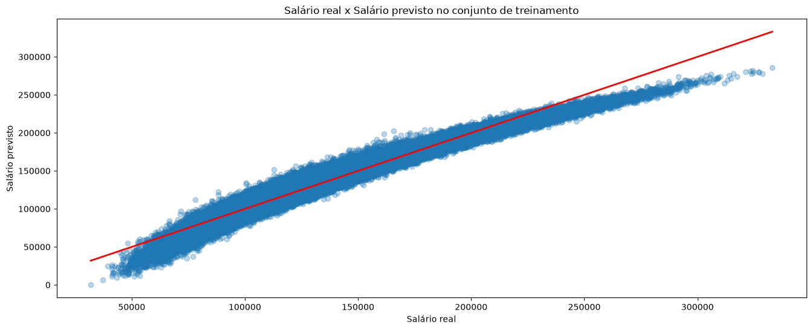
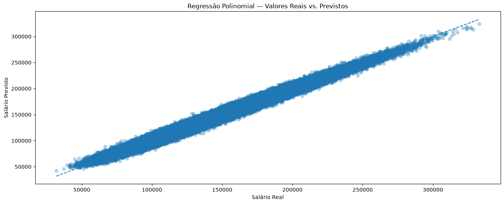

# 💼 Previsão de Salário com Machine Learning

## 📌 Sobre o Projeto

Este projeto tem como objetivo analisar os fatores que influenciam os salários de profissionais em diferentes setores e desenvolver modelos capazes de estimar a remuneração com base em características profissionais e organizacionais.

O dataset utilizado é um conjunto de dados sintético criado para fins de estudo em ciência de dados, contendo informações sobre cargos, experiência profissional, nível educacional, habilidades, certificações e características das empresas.

Por meio de análise exploratória de dados (EDA) e técnicas de aprendizado de máquina, foram investigados padrões relacionados à variação salarial e construídos modelos de regressão para realizar previsões.

---

## 🎯 Problema

Compreender como diferentes fatores profissionais influenciam a remuneração pode auxiliar tanto profissionais quanto empresas na tomada de decisões relacionadas à carreira, contratação e planejamento salarial.

A questão central deste projeto é:

**É possível prever o salário de um profissional com base em informações como cargo, experiência, educação, habilidades e certificações?**

---

## 📊 Dataset

O conjunto de dados contém aproximadamente:

* **250.000 registros**
* **10 variáveis**

Principais colunas do dataset:

| Coluna             | Descrição                                         |
| ------------------ | ------------------------------------------------- |
| `job_title`        | Cargo do profissional                             |
| `experience_years` | Anos de experiência                               |
| `education_level`  | Nível educacional                                 |
| `skills_count`     | Número de habilidades                             |
| `industry`         | Setor da empresa                                  |
| `company_size`     | Tamanho da empresa                                |
| `location`         | Localização                                       |
| `remote_work`      | Indica se o trabalho é remoto ou presencial       |
| `certifications`   | Número de certificações                           |
| `salary`           | Salário do profissional (variável alvo do modelo) |

---

## 🔎 Etapas do Projeto

O projeto foi desenvolvido seguindo as seguintes etapas:

1. Definição do problema
2. Análise exploratória dos dados (EDA)
3. Limpeza e tratamento dos dados
4. Preparação das variáveis
5. Construção dos modelos de Machine Learning
6. Avaliação dos modelos
7. Comparação dos resultados
8. Visualização dos resultados

---

## 🤖 Modelagem

Foram utilizados modelos de regressão para analisar a relação entre as características dos profissionais e seus respectivos salários.

### Regressão Linear Simples

A regressão linear simples foi utilizada como modelo inicial, permitindo observar a relação entre uma variável independente e o salário.

### Regressão Polinomial

Em seguida, foi utilizada a regressão polinomial para avaliar se uma relação não linear poderia representar melhor os dados e melhorar a capacidade preditiva do modelo.

---

## 📈 Visualização dos Resultados

### Regressão Linear Simples

O gráfico abaixo apresenta os resultados obtidos utilizando a regressão linear simples:

### Regressão Polinomial

A regressão polinomial foi utilizada para verificar se uma relação mais complexa entre as variáveis poderia representar melhor o comportamento dos salários:

---

## 📊 Comparação dos Modelos

A comparação entre os modelos foi realizada utilizando métricas de avaliação de regressão, permitindo verificar qual abordagem apresentou melhor desempenho na previsão dos salários.

Os resultados obtidos foram analisados considerando métricas como **R², MAE e RMSE**, buscando avaliar tanto a capacidade explicativa quanto o erro das previsões.

> Os valores apresentados nesta seção correspondem aos resultados obtidos durante a execução do notebook.

---

## 🎯 Conclusões

A análise permitiu observar como técnicas de regressão podem ser utilizadas para estimar salários a partir de características profissionais.

A regressão linear simples serviu como modelo inicial e referência para comparação. Posteriormente, a regressão polinomial permitiu avaliar relações não lineares e verificar se uma maior complexidade no modelo poderia proporcionar melhores previsões.

A comparação das métricas possibilitou identificar o modelo com melhor desempenho para o conjunto de dados analisado.

Apesar dos resultados obtidos, é importante considerar que o dataset utilizado é sintético. Dessa forma, os resultados não devem ser interpretados como uma representação direta do mercado de trabalho real.

---

## 🛠 Tecnologias Utilizadas

* **Python**
* **Pandas**
* **NumPy**
* **Matplotlib**
* **Scikit-learn**
* **Jupyter Notebook**

---

## 📚 Fonte dos Dados

O dataset utilizado neste projeto foi disponibilizado por **PinkPixelAI** na plataforma Kaggle.

🔗 [Kaggle — PinkPixelAI](https://www.kaggle.com/rhythmghai)

---

## 📚 Contexto

Este projeto faz parte do programa de formação em **Ciência de Dados**, sendo desenvolvido como prática para aplicação de técnicas de análise de dados e aprendizado de máquina em um problema de previsão.

---

⭐ **Projeto finalizado**
